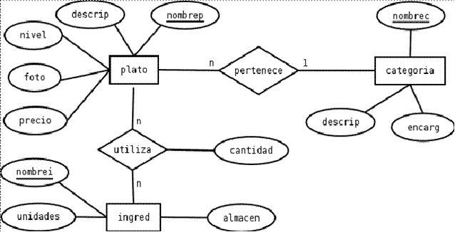

# Creación de BD



```SQL
CREATE TABLE Categorias(
    id SERIAL PRIMARY KEY,
    nombrec VARCHAR(50) UNIQUE NOT NULL,
    descrip VARCHAR(200) NOT NULL,
    encarg VARCHAR(100)
);

INSERT INTO Categorias (nombrec, descrip)
VALUES ('A','Los mejores platos');--id=1
INSERT INTO Categorias (nombrec, descrip,encarg)
VALUES ('B','Los segundos mejores platos', 'SI');--id=2

CREATE TABLE Platos(
    id SERIAL,
    nombrep VARCHAR(50) UNIQUE NOT NULL,
    descrip VARCHAR(200) NOT NULL,
    nivel VARCHAR(10),
    foto VARCHAR(255),--ruta
    precio DECIMAL(6,2),
    fk_id_categoria INT NOT NULL,
    PRIMARY KEY(id),
    FOREIGN KEY(fk_id_categoria) REFERENCES Categorias(id)
);
INSERT INTO Platos (nombrep, descrip, fk_id_categoria)
VALUES('Plato1', 'Primer Plato', 2);--id=1
INSERT INTO Platos (fk_id_categoria, nivel, nombrep, descrip )
VALUES(1, 'Nivel 1','Plato2', 'Segundo Plato' );--id=2
INSERT INTO Platos (nombrep, descrip, nivel, foto, precio, fk_id_categoria)
VALUES('Plato3', 'tercer Plato', 'Otro nivel','/home/davinia/fotos/plato3.jpg',23.19,2);--id=3

CREATE TABLE Ingredientes(
    id SERIAL,
    nombrei VARCHAR(50) UNIQUE NOT NULL,
    unidades DECIMAL(5,2) NOT NULL,
    almacen VARCHAR(100) NOT NULL,
    PRIMARY KEY(id)
);
INSERT INTO Ingredientes (nombrei, unidades, almacen)
VALUES('Ingrediente1', 2.4,'Almacén 1');--id=1
INSERT INTO Ingredientes (nombrei, unidades, almacen)
VALUES('Ingrediente2', 10.35,'Almacén 1');--id=2
INSERT INTO Ingredientes (nombrei, unidades, almacen)
VALUES('Ingrediente3', 7,'Almacén 2');--id=3
INSERT INTO Ingredientes (nombrei, unidades, almacen)
VALUES('Ingrediente4', 102.4,'Almacén 3');--id=4

CREATE TABLE Platos_Ingredientes(
    id SERIAL PRIMARY KEY,
    fk_id_plato INT NOT NULL,
    fk_id_ingrediente INT NOT NULL,
    cantidad DECIMAL(5,2) NOT NULL,
    FOREIGN KEY(fk_id_plato) REFERENCES Platos(id),
    FOREIGN KEY(fk_id_ingrediente) REFERENCES Ingredientes(id)
);
INSERT INTO Platos_Ingredientes (fk_id_plato, fk_id_ingrediente, cantidad)
VALUES(3, 1, 1.8);--id=1
INSERT INTO Platos_Ingredientes (fk_id_plato, fk_id_ingrediente, cantidad)
VALUES(3, 2, 0.5);--id=2
INSERT INTO Platos_Ingredientes (fk_id_plato, fk_id_ingrediente, cantidad)
VALUES(3, 4, 0.5);--id=3

SELECT * FROM Categorias;
SELECT * FROM Platos;
SELECT * FROM Ingredientes;
SELECT * FROM Platos_Ingredientes;

```
