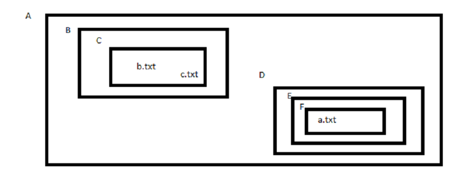

# Ejercicios

## 1

Partiendo del diagrama de directorios y ficheros siguiente:

1. Estando en B acceder a b.txt usando ruta relativa
2. Estando en C acceder a F usando ruta absoluta
3. Estando en F acceder a A usando ruta relativa
4. Estando en D acceder a c.txt usando ruta absoluta
5. Estando en C acceder a a.txt usando ruta abosulta
6. Estando en C acceder a a.txt usando ruta relativa
7. Estando en E acceder a E usando ruta absoluta
8. Estando en E acceder a E usando ruta relativa
9. Estando en E acceder a D usando ruta relativa
10. Estando en E acceder a F usando ruta relativa
11. Estando en E acceder a F usando ruta absoluta

## 2

Busca cómo modificar la cantidad de comandos que guarda history.

## 3

Ejecuta Ubuntu 22 y usa su terminal online para probar los comandos vistos

## 4

Crea los directorios del ejercicio 1 dentro de tu home y prueba las rutas indicadas, teniendo en cuenta que ahora A ya no es tu directorio raíz, porque dentro de tu Linux, este se representa por **/**
