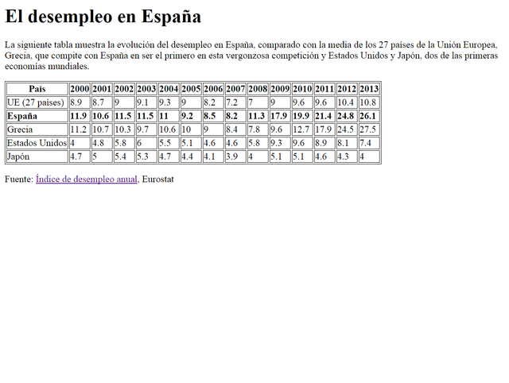

# HTML


HTML (Lenguaje de Marcas de Hipertexto, del inglés HyperText Markup Language) es el componente (lenguaje) más básico de la Web. Define el significado y la estructura del contenido web. Además de HTML, generalmente se utilizan otras tecnologías para describir la apariencia/presentación (Frontend) de una página web (CSS) o la funcionalidad/comportamiento (JavaScript).

"Hipertexto" hace referencia a los enlaces que conectan páginas web entre sí, ya sea dentro de un único sitio web o entre sitios web. Los enlaces son un aspecto fundamental de la Web, como ya veremos.

HTML utiliza "marcas" para etiquetar texto, imágenes y otro contenido para mostrarlo en un navegador Web. Las marcas HTML incluyen "elementos" especiales como

    <head>, <title>, <body>, <header>, <footer>, <article>, <section>, <p>, <div>, <span>, , <aside>, <audio>, <canvas>, <datalist>, <details>, <embed>, <nav>, <output>, <progress>, <video>, <ul>, <ol>, <li>

y muchos otros.

Un elemento HTML se distingue de otro texto en un documento mediante "etiquetas", que consisten en el nombre del elemento rodeado por "<" y ">" (corchetes angulares). El nombre de un elemento dentro de una etiqueta no distingue entre mayúsculas y minúsculas. Es decir, se puede escribir en mayúsculas, minúsculas o una mezcla. Por ejemplo, la etiqueta <title> se puede escribir como <Title>, <TITLE> o de cualquier otra forma, aunque actualmente trabajamos en minúsculas.

## Estructura básica de un HTML

Veamos la estructura básica de un documento html 5:

**Fichero: index.html**

```html
<!DOCTYPE html>
<html lang="es">
  <head>
    <meta charset="UTF-8" />
    <title>Document</title>
  </head>
  <body></body>
</html>
```

Analicemos este código:

1. **!DOCTYPE html** -> Indica al navegador que estamos ante un documento HTML5 y le indica al navegador cómo interpretarlo.

[MÁS_INFORMACIÓN_DOCTYPE](https://devcode.la/tutoriales/doctype-que-es-y-para-que-sirve/)

2. **html** -> Raíz del documento (todos los documentos HTML se almacenan en la memoria del navegador como un árbol, de ahí el nombre de raíz). Todos los documentos HTML tienen que tener una etiqueta que las encierre a todas y esa es esta. Además es una etiqueta que permite que pongamos dentro otras etiquetas, en este caso <head> y <body>.

3. **head** -> Etiqueta que almacena la información menos visible de la página, pero que permite configurarla de manera correcta. La información que nos permite añadir en ella es, entre otra, configuración de caracteres, idioma (como se puede ver en el atribuyto lang), título (aparece en la pestaña del navegador), favicon (imagen de la pestaña)...etc

4. **meta charset="UTF-8"** -> Configuración de caracteres. La etiqueta meta permite configurar metadatos en nuestro HTML.

[MÁS_INFORMACIÓN_META](https://www.ionos.es/digitalguide/paginas-web/desarrollo-web/los-meta-tags-mas-importantes-y-su-funcion/)

5. **title** -> Título de nuestra página. No se refiere a una sección, ni a una parte del documento, sino a la página a nivel general.

6. **body** -> Cuerpo de la página, lo que vamos a ver en nuestra web, va en esta sección.

## Primer ejemplo: Hola Mundo.

Ahora vamos a hacer nuestro **Hola Mundo** en HTML, pero antes hablemos de esto:

Para descubrir el origen del Hola Mundo es necesario remontarse a la década de los 70. En esa época, la programación estaba reservada a un grupo muy concreto de personas. Entre ellas se encontraba Brian Kernighan, autor de uno de los libros de programación más famosos de la historia: C Progamming Language (1978). Previamente, también habría escrito en 1973 un libro llamado A Tutorial Introduction to the Programming Language B, en el cual introdujo por primera vez el ejemplo del famoso “Hello World”.

```c
    main( )
    {
        extrn a, b, c;
        putchar(a);
        putchar(b);
        putchar(c);
        putchar('!*n');
    } a 'hell'; b 'o, w'; c 'orld';

```

La razón concreta por la que Hello World fue incluido en aquellos libros es desconocida. “Recuerdo que vi una serie de dibujos animados protagonizada por un huevo y un pollo en la que el pollo decía “Hello World” con frecuencia”, afirmó Kernighan a Forbes India. No obstante, el escritor de ambos libros no puede afirmar si esa fue la razón exacta por la que decidió incluir ese mensaje en sus libros.

**Hola Mundo en HTML (index.html)**

```html
<!DOCTYPE html>
<html lang="es">
  <head>
    <meta charset="UTF-8" />
    <title>Primer documento HTML5</title>
  </head>
  <body>
    Hola Mundo
  </body>
</html>
```

# Etiquetas

Como se ha comentado en la introducción las etiquetas se denotan entre corchetes angulares (<>).
En HTML5 disponemos de un listado de 142 etiquetas actualmente.

Las etiquetas nos permiten marcar información que puede ser, entre otros:

- Texto
- Enlaces
- Vídeos
- Audios

**Ejemplos:**

```html
<p>Esta etiqueta almacena texto</p>
<a href="http://www.google.es">Esta etiqueta tiene un enlace</a>

<!--Etiqueta para vídeo-->
<video width="320" height="240" controls>
  <source src="movie.mp4" type="video/mp4" />
  Tu navegador no soporta vídeo.
</video>
```

## Atributos

Los atributos se incluyen en las etiquetas y permiten configurar diferentes parámetros que amplían la funcionalidad de las etiquetas.

Por ejemplo en las etiquetas a y video ya hemos visto atributos, analicemos el formato:

```html
nombre_atributo = "valor/es"
<!--Siempre dentro de una etiqueta y entre comillas el valor-->
```

Los nombres válidos para los atributos de las etiquetas también están predefinidos dentro del lenguaje.

Comentemos un ejemplo básico:

```html
<a href="http://www.google.es">Esta etiqueta tiene un enlace</a>
```

href="url" -> Este es el atributo principal que permite la etiqueta <a> y

## Comentarios

La función de los comentarios, en HTML y en programación en general, es la de clarificar nuestro código.

En HTML se usan los siguientes caracteres:

- Inicio: "<!--"
- Fin: "-->"

**Ejemplo:**

```html
<!--Comentario de ejemplo en HTML5-->
```

## Texto y formato

### Texto

Vamos a hablar y a practicar con las etiquetas que se utilizan para formatear texto en HTML5.

### Párrafos

Una de las cuestiones más básicas que podemos definir a nivel de texto, es un párrafo, la etiqueta que nos permite realizar esta tarea es "p", veamos un ejemplo:

```html
<p>Esto es un párrafo de texto en HTML5</p>
```

[MÁS_INFORMACIÓN_P](https://developer.mozilla.org/es/docs/Web/HTML/Element/p)

## Cabeceras

Se usan para títulos, las etiquetas son las "h", que van desde h1 (título de mayor tamaño e importancia) hasta h6 (título de menor tamaño e importancia). Hay una jerarquía.

```html
<h1>Esto título con h1 en HTML5</h1>
<h2>Esto título con h2 en HTML5</h2>
<h3>Esto título con h3 en HTML5</h3>
<h4>Esto título con h4 en HTML5</h4>
<h5>Esto título con h5 en HTML5</h5>
<h6>Esto título con h6 en HTML5</h6>
```

[MÁS_INFORMACIÓN_H](https://developer.mozilla.org/es/docs/Web/HTML/Element/Heading_Elements)

### Ejercicio

- Crea un documento HTML5, con el siguiente texto y formato:

  **TEMA 1: Introducción y HTML5**

  En este primer tema vamos a ver, además de la introducción, todas las características de HTML5.

  **TEMA 2: CSS**

  En el tema 2 veremos lo más importante de CSS

  **TEMA 3: JavaScript Básico**

  En el tema 3 indagaremos en los fundamentos de JavaScript y de la programación estructurada.

### Formato texto

Veamos algunas de las etiquetas que nos ayudan a dar formato al texto:

    - <b> - Negrita (Bold Text)
    - <strong> - Resaltado (Important text)
    - <i> - Texto alternativo, por ejemplo términos técnicos (Italic text)
    - <em> - Cursiva (Emphasized text)
    - <mark> - Texto marcado o resaltado como referencia o anotación, debido a su relevancia o importancia en un contexto particular (Marked text)
    - <small> - Comentarios en letra pequeña, por ejemplo derechos de ator (Smaller text)
    - <sub> - Subíndice (Subscript text)
    - <sup> - Superíndice (Superscript text)
    - <pre> - Texto con formato (Preformatted text)
    - <span> - Texto que queremos identificar para aplicar estilos por ejemplo .

Realiza un ejemplo con cada una de ellas, para que puedas ver el aspecto del texto y te vayas familiarizando con ellas.

[MÁS INFORMACIÓN_FORMATO](https://www.w3schools.com/html/html_formatting.asp)

[Citas](https://www.w3schools.com/html/html_quotation_elements.asp)

### Divisiones

La etiqueta **div** se usa para dividir nuestra página, pero aún se conserva y nos va a ayudar en la parte de CSS, para poder aplicar estilos a una parte de nuestro código.

**Ejemplo:**

    <div id="division1">
        <p>Párrafo1</p>
        <p>Párrafo2</p>
    </div>

[MÁS INFORMACIÓN_DIV](https://developer.mozilla.org/es/docs/Web/HTML/Element/div)

### Listas

Se utilizan para organizar información de forma jerarquica.

En HTML disponemos de 3 tipos de listas:

1. Con orden
2. Sin orden
3. De definición

### Ordenadas

Las etiquetas que se usan en este caso son **ol** y **li**.

Podemos ordenar según diversos criterios:

1. 1 - Listas decimales -> Tipo por defecto
2. a - Listas alfabéticas en minúsculas
3. A - Listas alfabéticas en mayúsculas
4. i - Listas de números romanos en minúsculas
5. I - Listas de números romanos en mayúsculas

**Ejemplos:**

    <ol type="A">
        <li>Julio</li>
        <li>Carmen</li>
        <li>Ignacio</li>
        <li>Elena</li>
    </ol>

    <!-- O bien-->
    <ol reversed>
        <li>Julio</li>
        <li>Carmen</li>
        <li>Ignacio</li>
        <li>Elena</li>
    </ol>

### Desordenadas

Las etiquetas que se usan en este caso son **ul** y **li**.

**Ejemplos:**

    <ul>
        <li>FC. Barcelona</li>
        <li>Real Madrid</li>
        <li>Real Betis</li>
        <li>Atlético de Madrid</li>
    </ul>

### De definición

Las etiquetas que se usan en este caso son **dl**, **dt** y **dd**.

1. dl -> Lista
2. dt -> Término a definir
3. dd -> Definición

**Ejemplo:**

    <dl>
        <dt>Casa</dt>
        <dd>Edificio para habitar. Una casa de ocho plantas.</dd>
        <dt>Programación</dt>
        <dd>Acción y efecto de programar.</dd>
        <dt>Programar</dt>
        <dd>Elaborar programas para su empleo en computadoras.</dd>
    </dl>

[MÁS_INFORMACIÓN_LISTAS](https://www.w3schools.com/html/html_lists.asp)

### Tablas

Las tablas pueden ser muy útiles para ordenar información dentro de nuestra aplicación.

Las etiquetas básicas son:**table**, **th**, **tr** y **td**:

1. table -> Indica que comienza el bloque que compone una tabla
2. th -> Títilos de la cabecera de la tabla
3. tr -> Filas
4. td -> Columnas (datos en sí)

**Ejemplo:**

    <table class="default">
    <tr>
        <th>Título 1</th>
        <th>Título 2</th>
        <th>Título 3</th>
    </tr>
    <tr>
        <td>Celda 1</td>
        <td>Celda 2</td>
        <td>Celda 3</td>
    </tr>
    <tr>
        <td>Celda 4</td>
        <td>Celda 5</td>
        <td>Celda 6</td>
    </tr>
    </table>

[MÁS_INFORMACIÓN_TABLAS](https://developer.mozilla.org/es/docs/Web/HTML/Element/table)

### Ejercicios

1. A partir del siguiente código:

```
    <!DOCTYPE html>
    <html>
        <head>
        <title>El título de la página</title>
        </head>
    <body>
        <p><strong>HTML</strong> son las siglas de <em>HyperText Markup Language</em>, que puede traducirse como lenguaje de marcas o marcado de hipertexto.
        </p>
        <p>El lenguaje HTML se emplea para crear las páginas web. Es muy fácil ver el código HTML de una página web, la opción exacta cambia de un navegador a otro y también puede cambiar de una versión a otra de un mismo navegador, pero suelen tener un nombre similar.
        </p>
        <p>HTML se compone de etiquetas que se escriben entre los símbolos menor que y mayor que.</p>
        <p>Los inicios del lenguaje HTML se remontan al año 1990, cuando Tim Berners-Lee creó la primera página web.</p>
        </body>
    </html>

```

Realiza las siguientes modificaciones:

- Las siglas HTML deben aparecer como texto destacado en toda la página.
- Tim Berners-Lee debe aparecer como texto enfatizado en toda la página.
- Debes añadir el siguiente contenido:
  - Un encabezado de nivel 1 con el texto "HTML" antes de "HTML son las siglas de..."
  - Un encabezado de nivel 2 con el texto "Historia de HTML" antes de "Los inicios del lenguaje HTML..."
  - Un encabezado de nivel 2 con el texto "Versiones de HTML" antes de dos nuevos párrafos que contienen el texto "Tim Berners-Lee definió la primera versión de HTML en el año 1991" y "En la actualidad, la última versión de HTML es HTML5".

Aspecto del resultado final:


2. Usando listas, crea una página, cuyo resultado final sea el siguiente:
   

3. A partir del siguiente código e información:

```
    <!DOCTYPE html>
    <html>
        <head>
        <title>Desempleo</title>
        <style>
        table, tr, th, td {
        border: 1px solid black;
        }
        </style>
    </head>
        <body>

            El desempleo en España


            La siguiente tabla muestra la evolución del desempleo en España, comparado con la media de los 27 países de la Unión Europea, Grecia, que compite con España en ser el primero en esta vergonzosa competición y Estados Unidos y Japón, dos de las primeras economías mundiales.


            País
            2000
            2001
            2002
            2003
            2004
            2005
            2006
            2007
            2008
            2009
            2010
            2011
            2012
            2013


            UE (27 países)
            8.9
            8.7
            9
            9.1
            9.3
            9
            8.2
            7.2
            7
            9
            9.6
            9.6
            10.4
            10.8


            España
            11.9
            10.6
            11.5
            11.5
            11
            9.2
            8.5
            8.2
            11.3
            17.9
            19.9
            21.4
            24.8
            26.1


            Grecia
            11.2
            10.7
            10.3
            9.7
            10.6
            10
            9
            8.4
            7.8
            9.6
            12.7
            17.9
            24.5
            27.5


            Estados Unidos
            4
            4.8
            5.8
            6
            5.5
            5.1
            4.6
            4.6
            5.8
            9.3
            9.6
            8.9
            8.1
            7.4


            Japón
            4.7
            5
            5.4
            5.3
            4.7
            4.4
            4.1
            3.9
            4
            5.1
            5.1
            4.6
            4.3
            4


            Fuente: Índice de desempleo anual, Eurostat

        </body>
    </html>


```

**Nota:** en el código base que se te proporciona vas a encontrar una etiqueta nueva, la etiqueta **style**. Esta etiqueta permite introducir instrucciones de CSS (Cascading Style Sheets) en una página web. CSS se emplea para definir la presentación visual de una página web y se explica en la segunda parte de este curso. Las instrucciones que se han incluido tienen como objetivo que la tabla y las celdas de la tabla se muestren con un borde. Esto también se podría haber logrado con el atributo border de HTML, pero es mejor utilizar siempre CSS para todo lo relacionado con la presentación de una página web

El resultado final debe ser:



[ARBOL_DOM](https://es.javascript.info/dom-nodes)
