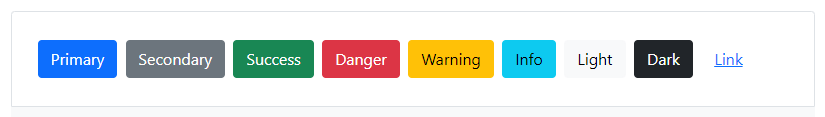

# Bootstrap 5


Bootstrap es un framework front-end utilizado para desarrollar aplicaciones web y sitios mobile first, o sea, con un layout que se adapta a la pantalla del dispositivo utilizado por el usuario. Desarrollado por Twitter en 2010, para estandarizar las herramientas de la compañía. El framework combina CSS y JavaScript para estilizar los elementos de una página HTML. Permite mucho más que, simplemente, cambiar el color de los botones y los enlaces.
Esta es una herramienta que proporciona interactividad en la página, por lo que ofrece una serie de componentes que facilitan la comunicación con el usuario, como menús de navegación, controles de página, barras de progreso y más.

## PRIMEROS PASOS

1. Para poder usar boostrap en nuestra página web , tan sólo tenemos que agregar el siguiente CDN

```html
<link
  href="https://cdn.jsdelivr.net/npm/bootstrap@5.1.3/dist/css/bootstrap.min.css"
  rel="stylesheet"
  integrity="sha384-1BmE4kWBq78iYhFldvKuhfTAU6auU8tT94WrHftjDbrCEXSU1oBoqyl2QvZ6jIW3"
  crossorigin="anonymous"
/>

<script
  src="https://cdn.jsdelivr.net/npm/bootstrap@5.1.3/dist/js/bootstrap.bundle.min.js"
  integrity="sha384-ka7Sk0Gln4gmtz2MlQnikT1wXgYsOg+OMhuP+IlRH9sENBO0LRn5q+8nbTov4+1p"
  crossorigin="anonymous"
></script>

```

2. Despues tán sólo basta con irnos a la documentación y saber que estilos queremos coger para personalizar nuestros elementos web. Por ejemplo si quisieramos coger estilos para los **botones** , tendriamos que ir a la siguiente sección:

```
https://getbootstrap.com/docs/5.1/components/buttons/
```

o directamente probar en nuestro **index.html** estos botones, y vereis el resultado al verlo en vuestro live server(como se vé en la siguiente imagen)



```html
<button type="button" class="btn btn-primary">Primary</button>
<button type="button" class="btn btn-secondary">Secondary</button>
<button type="button" class="btn btn-success">Success</button>
<button type="button" class="btn btn-danger">Danger</button>
<button type="button" class="btn btn-warning">Warning</button>
<button type="button" class="btn btn-info">Info</button>
<button type="button" class="btn btn-light">Light</button>
<button type="button" class="btn btn-dark">Dark</button>
<button type="button" class="btn btn-link">Link</button>
```

### CONCLUSIÓN

Bootstrap en resumen no es más que una gran hoja de estilos css en la que ya vienen preestablecidos estilos especificos para cada elemento web que existe, con la gran ventaja de ahorrarnos trabajo.

* * * 

## Ejercicios:

Implementa Boostrap en tu web personal:

1. Botones
2. Nav
3. Formulario

* * * 

## Recursos: 

- [Bootsrap 5](https://getbootstrap.com/)
- [Bootsrap 5](https://getbootstrap.com/)
- [Starter template](https://getbootstrap.com/docs/5.1/getting-started/introduction/)
- [Breakpoints-MediaQueries](https://getbootstrap.com/docs/5.1/layout/breakpoints/)
- [Containers](https://getbootstrap.com/docs/5.1/layout/containers/)
- [Grid System](https://getbootstrap.com/docs/5.1/layout/grid/)
- [Columns](https://getbootstrap.com/docs/5.1/layout/columns/)
- [Forms](https://getbootstrap.com/docs/5.1/forms/overview/)
- [Form Control](https://getbootstrap.com/docs/5.1/forms/form-control/)
- [Componentes (Ver varios)](https://getbootstrap.com/docs/5.1/components/accordion/)
