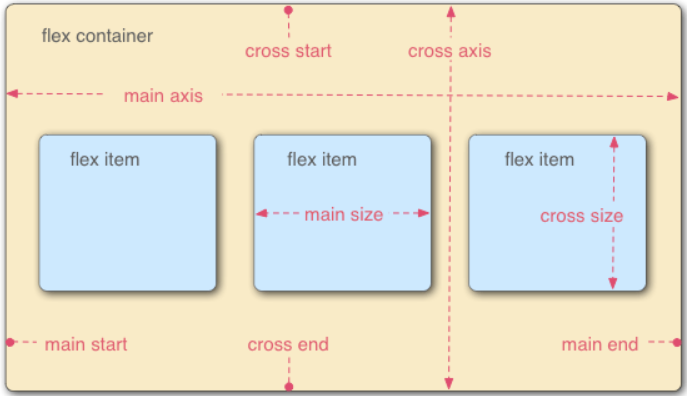
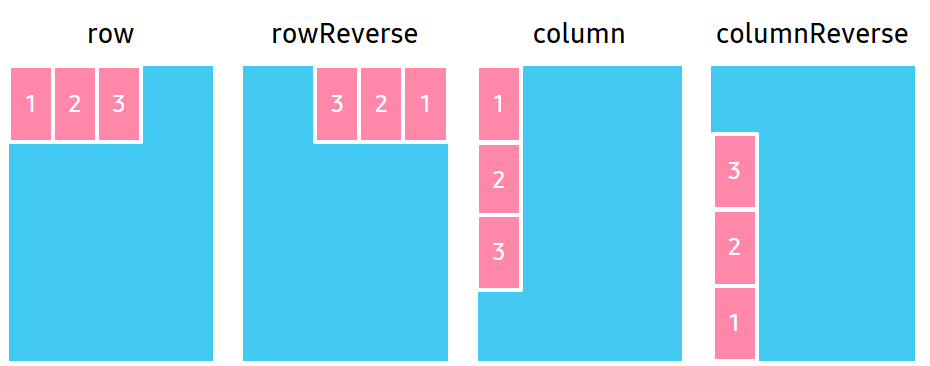
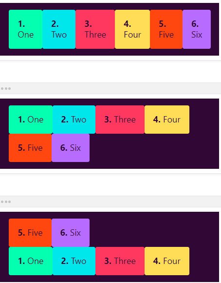
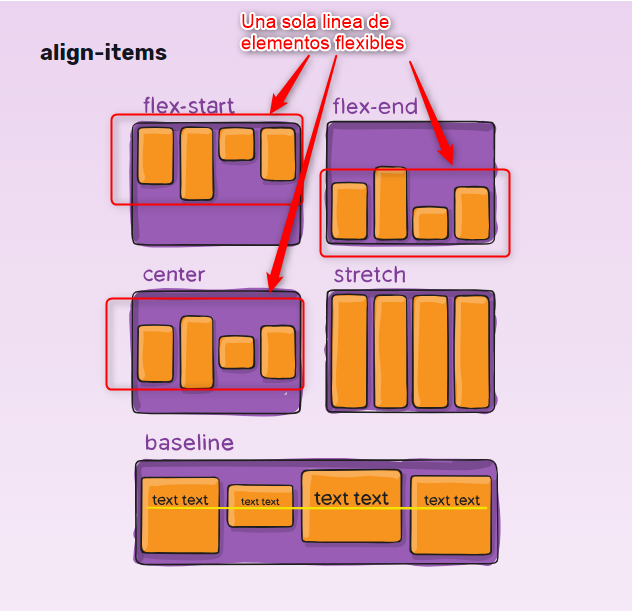
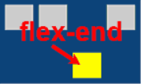
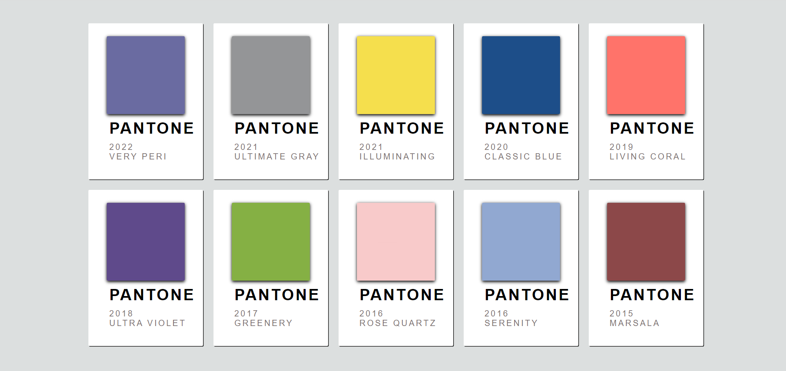

### [FLEXBOX](https://developer.mozilla.org/es/docs/Web/CSS/CSS_Flexible_Box_Layout/Basic_Concepts_of_Flexbox)

Flexbox es un **módulo** de diseño de CSS3 que se creó para mejorar la forma en la que se hace diseño responsive, evitando así el uso de float, escribiendo menos código y facilitando el posicionamiento de elementos, incluso no teniendo noción del tamaño de éstos. Básicamente la idea de Flexbox es poder alterar el ancho, alto y posicionamiento de elementos de la mejor manera con el espacio del que disponemos.

#### ORIENTACIÓN

El **eje principal** (main axis) es el eje que corre en la dirección en que se colocan los elementos flexibles. El inicio y el final de este eje se denominan inicio principal (main start) y final principal (main end).



El **eje transversal** (cross axis) es el eje que corre perpendicular a la dirección en la que se colocan los elementos flexibles. El inicio y el final de este eje se denominan inicio transversal (cross start) y extremo cruzado (cross end).

* * *

### Cajas 

1. El elemento **padre** tiene establecido display: flex se llama contenedor flexible.

```css
#padre{
    display: flex;
}
```

2. Los elementos **hijos** se presentan como cajas flexibles dentro del contenedor **padre**.

* * *

#### JUSTIFY-CONTENT

***flex-start***: Alinear items flex desde el comienzo. 

```css
#padre{
    display: flex;
    justify-content: flex-start;
}
```
***flex-end***: Alinear items desde el final. 

```css
#padre{
    display: flex;
    justify-content: flex-end;
}
```

***center***: Alinear items en el centro.

```css
#padre{
    display: flex;
    justify-content: center;
}
```
***space-between***: Separación igual de los items. el primero se queda al inicio y el último al final.

```css
#padre{
    display: flex;
    justify-content: space-between;
}
```
***space-around***: Los items tienen el mismo espacio entre ellos, menos el espacio que hay en el inicio y el final.

```css
#padre{
    display: flex;
    justify-content: space-around;
}
```

***space-evenly***: Los items tienen el mismo espacio a su alrededor.

```css
#padre{
    display: flex;
    justify-content: space-evenly;
}
```

* * *


* * *

#### FLEX-DIRECTION

***row***: Se colocan en fila (predeterminada). 

```css
#padre{
    display: flex;
    flex-direction: row;
}
```

***row-reverse***: Se colocan en fila pero comienzan desde su final.

```css
#padre{
    display: flex;
    flex-direction: row-reverse;
}
```

***column***: Se colocan en columna pero comienzan desde su final.

```css
#padre{
    display: flex;
    flex-direction: column;
}
```

***column-reverse***: Se colocan en columna pero comienzan desde su final.

```css
#padre{
    display: flex;
    flex-direction: column-reverse;
}
```


* * *

#### FLEX-WRAP


***flex-wrap: wrap***: Los elementos flex son colocados en varias líneas. Si se fuera a desbordar se coloca la siguiente caja en el orden que estuviera su flex-direction. (predeterminado)

```css
#padre{
    display: flex;
    flex-wrap: wrap;
}
```

***flex-wrap: nowrap***: Los elementos flex son distribuidos en una sola línea, lo cual puede llevar a que se desborde el contenedor flex.

```css
#padre{
    display: flex;
    flex-wrap: nowrap;
}
```

***flex-wrap: wrap-reverse***: Actúa como wrap pero cross-start y cross-end están intercambiados.

```css
#padre{
    display: flex;
    flex-wrap: wrap-reverse;
}
```
* * *


* * *

#### ALIGN-ITEMS

***start***: Los elementos se agrupan uno junto al otro hacia el borde inicial del contenedor de alineación en el eje apropiado.

```css
#padre{
    display: flex;
    align-items: start;
}
```

***end***: Los elementos se agrupan uno junto al otro hacia el borde final del contenedor de alineación en el eje apropiado.

```css
#padre{
    display: flex;
    align-items: end;
}
```

***center***: Los márgenes del elemento flexible son centrados dentro de la línea sobre su eje transversal. Si el tamaño transversal del elemento es mayor al del contenedor, se excederá por igual en ambas direcciones.

```css
#padre{
    display: flex;
    align-items: center;
}
```

***baseline***: Todos los elementos flexibles son ajustados de modo que sus bases queden alineadas. El elemento con la distancia mayor entre su límite transversal inicial y su base es combinado con el borde transversal de la línea.

```css
#padre{
    display: flex;
    align-items: baseline;
}
```
***stretch***: Las elementos flexibles son estirados de modo que el tamaño transversal de sus límites sea el mismo de la línea, manteniendo sus restricciones de anchura y altura.

```css
#padre{
    display: flex;
    align-items: stretch;
}
```



* * *

#### ALIGN-SELF

```css
#hijo{
    display: flex;
    align-self: flex-end;
}
```


* * *

#### FLEX-FLOW: 

Es una mezcla de flex-direction y flex-wrap en uno.

```css
#padre{
    display: flex;
    flex-flow: column-reverse wrap-reverse;
}
```

* * *

#### EJERCICIOS: 

**1.** Hacer los ejercicios del juego de las ranas: https://flexboxfroggy.com/#es 

**2.** Hacer en parejas el mismo formato que aparece en la siguiente pantalla:



[COLORES](../assets/clase36/colores/)

#### RECURSOS

* Teoría con ejemplos: https://cssreference.io/

* Recomendados:  https://developer.mozilla.org/es/docs/Web/CSS/flex-direction

[WEB_EJEMPLOS_NACHO_COKE](https://fs-abr-22-taller-flex-box.netlify.app/)