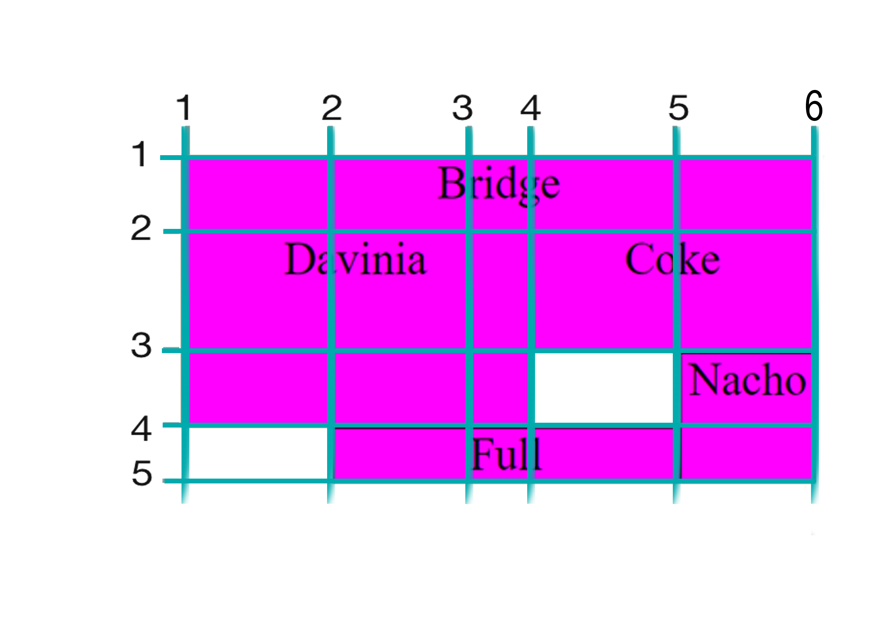

### [GRID](https://developer.mozilla.org/es/docs/Web/CSS/CSS_Grid_Layout)

CSS Grid Layout es un modelo de maquetación CSS en base a una rejilla. Al igual que Flexbox, CSS Grid también se integra con la ayuda de un elemento contenedor y elementos de CSS Grid.

```css
#padre {
  display: grid;
}
```

### 1. Grid-template-columns

La propiedad CSS grid-template-columns define el nombre de las líneas y las funciones de tamaño de línea de grid columns.

```css
#padre {
  display: grid;
  grid-template-columns: 20% auto 100px;
}
```


---

### Grid-template-rows

La propiedad CSS grid-template-columns define el nombre de las líneas y las funciones de tamaño de línea de grid columns.

```css
#padre {
  display: grid;
  grid-template-columns: auto auto auto;
  grid-template-rows: 20% 20% auto;
}
```

---

### 2. Grid-template-rows

La propiedad CSS grid-template-rows define el nombre de las líneas y las funciones de tamaño de línea de grid rows.

```css
#padre {
  display: grid;
  grid-template-columns: auto auto auto;
  grid-template-rows: 20% 20% auto;
}
```


---

### Gap

Gap determina la distancia de los elementos dentro del **grid**

```css
#padre {
  display: grid;
  grid-template-columns: auto auto auto;
  gap: 10px;
}
```


---

### 3. Grid-template-areas

Un grid area es una o más grid cells, que forman un área rectangular en la cuadrícula. Los grid areas se crean cuando se coloca un ítem usando disposición basada en líneas o cuando se definen áreas usando grid areas con nombre.

```css
#padre {
  display: grid;
  grid-template-columns: 50px 100px 50px 100px;
  grid-template-rows: 50px 80px 50px;
  grid-template-areas:
    "bridge nacho coke coke"
    "hugo hugo hugo hugo"
    "davinia davinia davinia davinia";
}
.grid-1 {
  grid-area: bridge;
}
.grid-2 {
  grid-area: davinia;
}
.grid-3 {
  grid-area: coke;
}
.grid-4 {
  grid-area: nacho;
}
.grid-5 {
  grid-area: hugo;
}
```


---

### 4. Grid: Juego de Barcos

Vamos a ver diferentes formas de organizar las celdas, para ello utilizaremos diferentes códigos. La lectura para buscar la cardinalidad de las columnas es desde el eje X, y el de las celdas es el eje Y.


Cuadrícula **Padre**:

```css
#padre {
  display: grid;
  grid-template-columns: 100px 80px 50px 100px;
  grid-template-rows: 50px 80px 50px;
}
```


**1º. Forma:**

Se cuenta desde donde va a empezar la celda y va a terminar, tanto para columnas como para las filas.

- Fila: ***grid-row-start/end***
- Columna: ***grid-column-start/end***

```css
.hijo {
  grid-column-start: 1;
  grid-column-end: 4;

  grid-row-start: 2;
  grid-row-end: 4;
}
```


* * * 

**2º. Forma:**

Se cuenta desde donde va a empezar la celda y va a terminar, tanto para columnas como para las filas.

Fila: ***grid-row: start/end ;***
Columna: ***grid-column: start/end;***


```css

.hijo {
  grid-column: 1/4;
  grid-row: 2/4;
}

```


* * *

**3º. Forma:**

Se indica donde va a empezar la celda y **span 3** nos dice cuantos huecos va a ocupar.

Fila: ***grid-row: 2 / span 3***
Columna: ***grid-column: 3 / span 2***


```css
.bridge {
  grid-column: 1/-1;
}

.davinia {
  grid-row-start: 2;
  grid-row-end: 4;
  grid-column-start: 1;
  grid-column-end: 4;
}

.coke {
  grid-row: 2;
  grid-column: 4/6;
}

.nacho {
  grid-row: 3/span 2;
  grid-column: 5;
}

.full{
  grid-row: 4;
  grid-column: 2/ span 3;
}

```
* * *



* * *

### Ejercicios
**1.** Recrear la imagen de Piet Mendrean utilizando grid. [Link a la Imagen](https://i.pinimg.com/736x/c0/f5/de/c0f5de558ffbd9a4ca4617264472d0f3.jpg)
**2.** Los huecos en blanco están vacios, es decir, no son divs de color blanco.
**3.** Las aristas que se ven en negro, no hay que pintarlas.


* * * 

### Recursos

Para probar psociones de las celdas: http://w3.unpocodetodo.info/css3/grid-items.php

https://www.youtube.com/watch?v=9zBsdzdE4sM

[WEB_EJEMPLO_COKE_NACHO](https://fs-abr-22-taller-grid.netlify.app/)


