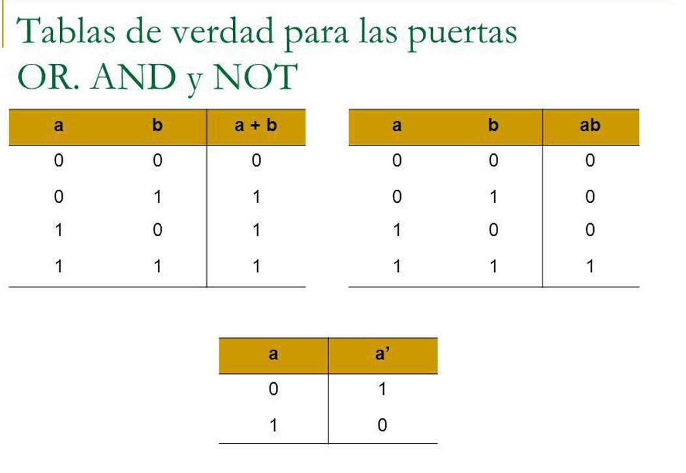

# Conceptos básicos

## Tipos de datos
Antes de continuar debemos definir el concepto de tipo de dato. Hay que tener en cuenta que cada dato que almacenamos en memoria, tanto si es volátil (RAM), como si es persistente (disco) ocupa un espacio. El espacio que ocupa la información depende del tipo de dato al que pertenece, si necesitamos guardar más información el espacio de memoria, como es lógico debe ser mayor.

En ese sentido, hay una relación directa entre el tipo de dato y el tamaño del espacio de memoria para albergar ese dato.

Lo que define un tipo de dato es un rango de valores que puede tomar, ya que por la manera en la que se estructura la memoria, cada dato ocupará una cantidad de bytes y por tanto se podrá representar un rango concreto como máximo.

Tipos de datos básicos o primitivos: 
- Booleanos: representación de verdadero o falso (puede ser un bit 0 o 1, false o true, F, T…o lo que el lenguaje haya definido), se usan para condiciones o valores lógicos.
- Caracteres: Números, letras o símbolos.
- Números enteros (pueden o no incluir negativos)
- Número reales (con decimales y pueden o no incluir negativos).

Se han expuesto por orden de ocupación de espacio de memoria (en orden creciente) y cada lenguaje tiene subtipos o variantes Las cadenas de caracteres, es decir, las frases o conjuntos de caracteres (contraseñas por ejemplo), no se consideran tipos de datos básicos.

## Tablas de verdad AND, OR y NOT



## Variables
Este es un concepto general de programación. Se usan para almacenar valores o resultados, pueden ser de cualquier tipo de datos y lo novedoso es que les puede poner un nombre.

A más bajo nivel, es un hueco en memoria volátil (RAM), que tiene un tamaño asociado a su tipo, como ya hemos comentado, y que permite almacenar valores.

Ejemplo en Javascript: 

```javascript

    var n = 9; //usada para variables globales
    let n2 = 8; //usada para variables locales

    var a = true; //Booleano
    var c = 'a'; //Caracter
    var n3 = 7; //Entero
    var n4 = 6.78; //Real

```

[VAR](https://developer.mozilla.org/es/docs/Web/JavaScript/Reference/Statements/var)

[LET](https://developer.mozilla.org/es/docs/Web/JavaScript/Reference/Statements/let)		

## Constantes 
Se trata del mismo concepto de variable, pero la idea es que el valor que contiene no se va a cambiar durante todo el tiempo que dura la ejecución de tu programa.

```javascript

    const PI = 3.1416; 

```

[CONST](https://developer.mozilla.org/es/docs/Web/JavaScript/Reference/Statements/let)		

## Estructuras de datos

Se trata de una forma particular de organizar datos y ubicarlos en memoria durante la ejecución de una aplicación para resolver de manera más eficiente un problema.

Hay diversas estructuras de datos y cada una de ellas es idónea para un problema específico.

Veamos algunos ejemplos: 

- Array o vector
- Cadena de caracteres 
- Array bidimensional o matriz
- Lista
- Pila
- Cola
- Árbol
- Grafo
- JSON o diccionario
- Registro o estructura
- Clase

La definición de “Clase” es uno de los conceptos más importantes de Programación Orientada a Objetos, por lo que vamos a dejarla pendiente.

Veamos los arrays: 

## Arrays de una dimensión
Se trata de un conjunto de elementos consecutivos en memoria, en el caso de Javascript es dinámico, lo que indica que se puede modificar su tamaño y además el tipo de dato de los elementos puede variar, es decir, podemos tener tres enteros y un real, por ejemplo

Veamos un ejemplo en Javascript: 

```javascript

    let frutas = ["Manzana", "Banana"];
    console.log(frutas); // Manzana y Banana 
    console.log(frutas.length); // 2
    let primero = frutas[0] // Manzana
    let ultimo = frutas[frutas.length - 1]; // Banana
    let nuevaLongitud = frutas.push('Naranja'); // Añade "Naranja" al final
    // ["Manzana", "Banana", "Naranja"]
    ultimo = frutas.pop(); // Elimina "Naranja" del final
    // ["Manzana", "Banana"]

```

## Cadenas de caracteres
Se trata de elementos que almacenan más un caracter, la disposición de los mismos es un array, pero por su uso tan habitual, dispone de un tratamiento especial. 

Ejemplo: 

```javascript

    var frase = "Hola Mundo!";
    alert(frase);

```

### Ejercicio
- Realiza una página en HTML, que disponga de dos botones, uno de ellos tendrá el texto "Añadir" y al pulsarlo insertará una fruta nueva en el array de frutas de nuestro ejemplo y le mostratá el array al usuario; el otro tendrá el texto "Borrar" y eliminará la última fruta del array y volverá a mostrarlo.
