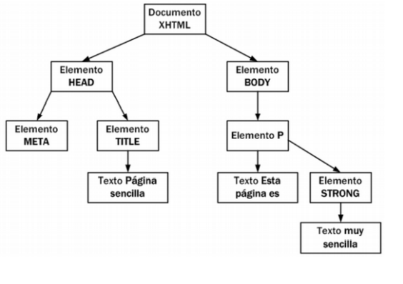
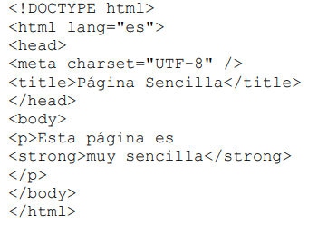

# DOM (Document Object Model) 
Ya hemos hablado del árbol que se genera en la memoria de nuestros navegadores y que representa a nuestro HTML.

Recordemos un ejemplo: 

Este árbol: 



Se corresponde con este HTML: 



## Tipos de nodos en los árboles
La especificación completa de DOM define 12 tipos de nodos, aunque las páginas HTML habituales se pueden manipular manejando solamente cuatro o cinco tipos de nodos (los más comunes):

- **Document:** nodo raíz del que derivan todos los demás nodos del árbol.

- **Element:** representa cada una de las etiquetas HTML. Se trata del único nodo que puede contener atributos y el único del que pueden derivar otros nodos.

- **Attr:** se define un nodo de este tipo para representar cada uno de los atributos de las etiquetas HTML, es decir, uno por cada par atributo=valor.

- **Text:** nodo que contiene el texto encerrado por una etiqueta HTML.

- **Comment:** representa los comentarios incluidos en la página HTML.

## Herramientas de Javascript para DOM

## Acceso directo a los nodos
Una vez construido automáticamente el árbol completo de nodos DOM, ya es posible utilizar las funciones DOM para acceder de forma directa a cualquier nodo del árbol. Como acceder a un nodo del árbol es equivalente a acceder a "un trozo" de la página, una vez construido el árbol, ya es posible manipular de forma sencilla la página: acceder al valor de un elemento, establecer el valor de un elemento, mover un elemento de la página, crear y añadir nuevos elementos, etc.

DOM proporciona dos métodos alternativos para acceder a un nodo específico: acceso a través de sus nodos padre y acceso directo.

Las funciones que proporciona DOM para acceder a un nodo a través de sus nodos padre consisten en acceder al nodo raíz de la página y después a sus nodos hijos y a los nodos hijos de esos hijos y así sucesivamente hasta el último nodo de la rama terminada por el nodo buscado. Sin embargo, cuando se quiere acceder a un nodo específico, es mucho más rápido acceder directamente a ese nodo y no llegar hasta él descendiendo a través de todos sus nodos padre. Por ese motivo, no se van a presentar las funciones necesarias para el acceso jerárquico de nodos y se muestran solamente las que permiten acceder de forma directa a los nodos.

**Por último, es importante recordar que el acceso a los nodos, su modificación y su eliminación solamente es posible cuando el árbol DOM ha sido construido completamente**, es decir, después de
que la página HTML se cargue por completo. Más adelante se verá cómo asegurar que un código JavaScript solamente se ejecute cuando el navegador ha cargado entera la página HTML.

### getElementsByTagName()
Obtiene todos los elementos de la página HTML cuya etiqueta sea igual que el parámetro que se le pasa a la función y los devuelve con formato array (por esto su nombre es en plural).

El siguiente ejemplo muestra cómo obtener todos los párrafos (p) de una página HTML:

```javascript

    var parrafos = document.getElementsByTagName("p");

```

El valor que se indica delante del nombre de la función (en este caso, **document**) es el nodo a partir del cual se realiza la búsqueda de los elementos. En este caso, como se quieren obtener todos los párrafos de la página, se utiliza el valor document como punto de partida de la búsqueda.

El valor que devuelve la función es un array con todos los nodos que cumplen la condición de que su
etiqueta coincide con el parámetro proporcionado.

El siguiente ejemplo obtiene el texto del primer párrafo del HTML: 

```javascript

    var primerParrafo = parrafos[0].innerHTML;

```

- innerHTML -> Nos devuelve el contenido de los párrafos (el texto en sí)

De la misma forma, se podrían recorrer todos los párrafos de la página con el siguiente código:

```javascript
    
    for(var i=0; i<parrafos.length; i++) {
        var parrafo = parrafos[i].innerHTML;
    }

```

Veamos un ejemplo completo: 

```HTML
    
    <!DOCTYPE html> 
    <html lang="es"> 
        <head> 
        <meta charset="UTF-8" /> 
        <title>JavaScript</title> 
        <script type="text/javascript"> 
            var parrafos; 
            function ejecutar () { 
                parrafos = document.getElementsByTagName("p"); 
                for(let i=0; i<parrafos.length; i++) { 
                    let parrafo = parrafos[i].innerHTML; 
                    alert (parrafo); 
                } 
            } 
        </script> 
        </head> 
        <body> 
            <p>Este es el primer párrafo</p> 
            <p>Este es el segundo párrafo</p> 
            <input type="button" value="Ver párrafos" onclick="ejecutar();" />    
        </body> 
    </html>

```

También podemos hacer algo como lo siguiente (aplicar la función de forma recursiva): 

```javascript

    var parrafos = document.getElementsByTagName("p");
    var primerParrafo = parrafos[0];
    var enlacesPrimerP = primerParrafo.getElementsByTagName("a");

```

**Ejercicio: Describe cada línea del ejemplo anterior y realízalo con menos líneas de código**

### getElementsByName()
La función getElementsByName() es similar a la anterior, pero en este caso se buscan los elementos
cuyo atributo atributo name sea igual al parámetro proporcionado. En el siguiente ejemplo, se obtiene directamente el único párrafo con el nombre indicado:

```HTML

    var parrafoEspecial = document.getElementsByName("especial");
    <p name="prueba">...</p>
    <p name="especial">...</p>
    <p>...</p>

```

El atributo name se puede repetir en un HTML, por esta razón también devuelve un array.

Ejemplo: 

```HTML

    <!DOCTYPE html> 
    <html lang="es"> 
        <head> 
        <meta charset="UTF-8" /> 
        <title>JavaScript</title> 
        <script type="text/javascript"> 
            var parrafos; 
            
            function ejecutar () { 
                parrafos = document.getElementsByName("especial"); 
                for(var i=0; i<parrafos.length; i++) { 
                    var parrafo = parrafos[i].innerHTML; 
                    window.alert (parrafo); 
                } 
            } 
        </script> 
        </head> 
        <body> 
            <p name="normal">Un párrafo normal</p> 
            <p name="especial">Contenido especial 1</p> 
            <p name="especial">Contenido especial 2</p> 
            <button onclick="ejecutar();"> Mostrar Párrafos Especiales</button> 
        </body> 
    </html> 

```

### getElementById()
Devuelve el elemento HTML cuyo atributo id coincide con el parámetro indicado en la función. Como el atributo id debe ser único, la función devuelve únicamente el nodo deseado.

Ejemplo: 

```HTML

    <!DOCTYPE html>
    <html lang="es">
        <head> 
            <meta charset="UTF-8" /> 
            <title>JavaScript</title> 
            <script language="javascript"> 
                function ejecutar() { 
                    var parrafoElegido = window.prompt (" Seleccione Párrafo (1,2,3): "); 
                    var parrafo = document.getElementById (parrafoElegido); 
                    document.write (parrafo.innerHTML); // Escribimos directamente dentro del body (hay que usar innerHTML)
                } 
            </script> 
        </head> 
        <body> 
            <p id="1"> Primer Párrafo</p> 
            <p id="2"> Segundo Párrafo</p> 
            <p id="3"> Tercer Párrafo</p> 
            <input type="button" value="Ver párrafo" onclick="ejecutar();" /> 
        </body> 
    </html> 

```

## Ejercicio 
A partir del siguiente HTML: 

```html

    <!DOCTYPE html> 
    <html lang="es"> 
    <head> 
        <meta charset="UTF-8" /> 
        <title>Ejercicio DOM básico</title>
    </head>
    <body>
        <p>Lorem ipsum dolor sit amet, <a href="http://prueba">consectetuer adipiscing elit</a>. Sed 
        mattis enim vitae orci. Phasellus libero. Maecenas nisl arcu, consequat congue, commodo nec,
        commodo ultricies, turpis. Quisque sapien nunc, posuere vitae, rutrum et, luctus at, pede.
        Pellentesque massa ante, ornare id, aliquam vitae, ultrices porttitor, pede. Nullam sit amet
        nisl elementum elit convallis malesuada. Phasellus magna sem, semper quis, faucibus ut,
        rhoncus non, mi. <a href="http://prueba2">Fusce porta</a>. Duis pellentesque, felis eu
        adipiscing ullamcorper, odio urna consequat arcu, at posuere ante quam non dolor. Lorem ipsum
        dolor sit amet, consectetuer adipiscing elit. Duis scelerisque. Donec lacus neque, vehicula
        in, eleifend vitae, venenatis ac, felis. Donec arcu. Nam sed tortor nec ipsum aliquam
        ullamcorper. Duis accumsan metus eu urna. Aenean vitae enim. Integer lacus. Vestibulum
        venenatis erat eu odio. Praesent id metus.</p>
        <p>Aenean at nisl. Maecenas egestas dapibus odio. Vestibulum ante ipsum primis in faucibus
        orci luctus et ultrices posuere cubilia Curae; Proin consequat auctor diam. <a
        href="http://prueba">Ut bibendum blandit est</a>. Curabitur vestibulum. Nunc malesuada
        porttitor sapien. Aenean a lacus et metus venenatis porta. Suspendisse cursus, sem non dapibus
        tincidunt, lorem magna porttitor felis, id sodales dolor dolor sed urna. Sed rutrum nulla
        vitae tellus. Sed quis eros nec lectus tempor lacinia. Aliquam nec lectus nec neque aliquet
        dictum. Etiam <a href="http://prueba3">consequat sem quis massa</a>. Donec aliquam euismod
        diam. In magna massa, mattis id, pellentesque sit amet, porta sit amet, lectus. Curabitur
        posuere. Aliquam in elit. Fusce condimentum, arcu in scelerisque lobortis, ante arcu
        scelerisque mi, at cursus mi risus sed tellus.</p>
        <p>Donec sagittis, nibh nec ullamcorper tristique, pede velit feugiat massa, at sollicitudin
        justo tellus vitae justo. Vestibulum aliquet, nulla sit amet imperdiet suscipit, nunc erat
        laoreet est, a <a href="http://prueba">aliquam leo odio sed sem</a>. Quisque eget eros
        vehicula diam euismod tristique. Ut dui. Donec in metus sed risus laoreet sollicitudin. Proin
        et nisi non arcu sodales hendrerit. In sem. Cras id augue eu lorem dictum interdum. Donec
        pretium. Proin <a href="http://prueba4">egestas</a> adipiscing ligula. Duis iaculis laoreet
        turpis. Mauris mollis est sit amet diam. Curabitur hendrerit, eros quis malesuada tristique,
        ipsum odio euismod tortor, a vestibulum nisl mi at odio. <a href="http://prueba5">Sed non
        lectus non est pellentesque</a> auctor.</p>
    </body>
    </html> 

```

Se solicita: 

- Número de enlaces de la página
- Dirección a la que enlaza el penúltimo enlace
- Numero de enlaces que enlazan a http://prueba
- Número de enlaces del tercer párrafo

**AYUDA: Si queremos acceder al contenido de un atributo de un nodo elemento es suficiente con usar nodo.atributo (ej: p.id accede al contenido del id del nodo almacenado en p)**


