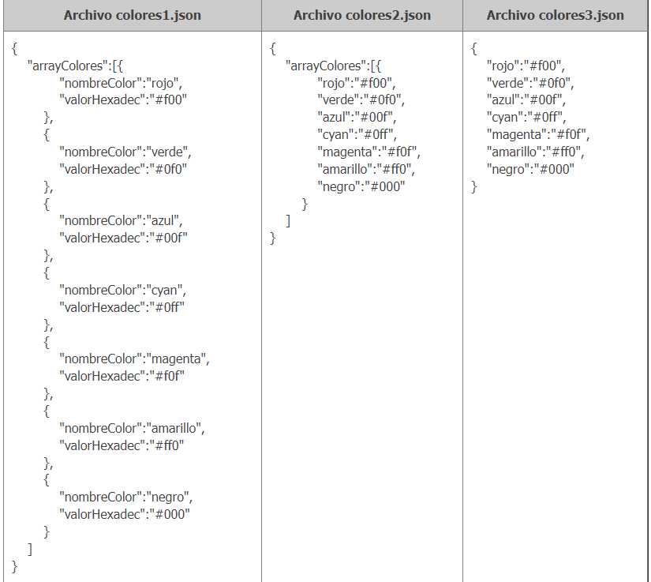

# JSON (JavaScript Object Notation)
Los JSON son cadenas de caracteres útiles cuando se quiere transmitir datos y se han convertido en un estándar muy usado en desarrollo web. Debe ser convertido a un objeto nativo de JavaScript cuando se requiera acceder a sus datos. Ésto no es un problema, dado que JavaScript posee un objeto global JSON que tiene los métodos disponibles para convertir entre ellos.

Convertir una cadena a un objeto nativo se denomina parsing, mientras que convertir un objeto nativo a una cadena para que pueda ser transferido a través de la red se denomina stringification.

Veamos ejemplos de JSON: 



Un ejemplo con conversión: 

```Javascript

    console.log(JSON.parse('{}'));              // {}
    console.log(JSON.parse('true'));            // true
    console.log(JSON.parse('"foo"'));           // "foo"
    console.log(JSON.parse('[1, 5, "false"]')); // [1, 5, "false"]
    console.log(JSON.parse('null'));            // null
    console.log(JSON.parse('{"nombre": "Davinia", "apellido": "de la Rosa"}')); //{nombre: "Davinia", apellidos: "de la Rosa"}
    console.log(JSON.parse('{"nombre": "Davinia", "apellido": "de la Rosa"}').nombre); //Davinia
    var objeto = JSON.parse('{"nombre": "Davinia", "apellido": "de la Rosa"}');
    //Formas de acceso equivalentes
    console.log(objeto.apellido);
    console.log(objeto["apellido"]);

```

JSON.parse no admite , al final, veamos dos ejemplos que darían error: 

```Javascript 

    JSON.parse('[1, 2, 3, 4, ]'); //SyntaxError
    JSON.parse('{"foo" : 1, }');  //SyntaxError

```

## Arrays como JSON
Ya podemos intuir por los ejemplos que podemos combinar las {} (diccionarios o conjuntos clave-valor) y los [] dentro de los JSON como queramos. 

Veamos un ejemplo, algo más complejo: 

```Javascript 

    [
    {
      "nombre": "Francisco Ramirez",
      "edad": 29,
      "puesto": "Contable",
      "Emails": [
        "francisco@gmail.com",
        "francisco@hotmail.es",
        "francisco@thebridgeschool.es"
      ]
    },
    {
        "nombre": "Isabel Pérez",
        "edad": 31,
        "puesto": "Profesora",
        "Emails": [
          "isabel@gmail.com",
          "isabel@hotmail.es",
          "isabel@thebridgeschool.es"
        ]
      }
  ]

```
[MÁS_INFO_JSON](https://developer.mozilla.org/es/docs/Web/JavaScript/Reference/Global_Objects/JSON)

## Ejercicios 

1. En el JSON del último ejemplo indica el código de acceso al email de The Bridge de Isabel.
2. Partiendo del siguiente JSON

```Javascript 
    {
        "localidade 1": {
        "Continente": "África",
        "País": "Angola",
        "Capital": "Luanda"
        },
        "localidade 2": {
        "Continente": "América do Norte",
        "País": "Estados Unidos",
        "Capital": "Washington DC"
        },
        "localidade 3": {
        "Continente": "América Central",
        "País": "México",
        "Capital": "Cidade do México"
        },
        "localidade 4": {
        "Continente": "América do Sul",
        "País": "Brasil",
        "Capital": "Brasília"
        },
        "localidade 5": {
        "Continente": "Europa",
        "País": "Espanha",
        "Capital": "Madri"
        },
        "localidade 6": {
        "Continente": "Europa",
        "País": "Alemanha",
        "Capital": "Berlim"
        },
        "localidade 7": {
        "Continente": "Oceania",
        "País": "Austrália",
        "Capital": "Camberra"
        },
        "localidade 8": {
        "Continente": "Ásia",
        "País": "Japão",
        "Capital": "Tóquio"
        }
    }

```

Siendo a la variable que almacena el JSON
- Código para obtener el país de la localidade 8
- Código que permite añadir una localidad a tu elección
- Modifica la localidade 4, añadiendo el número de habitantes
- Cambia la estructura del JSON de forma que sea más directo acceder a las capitales de las localidades, dado que va a ser el dato que más vamos a consultar

3. A partir de la siguiente información, diseña y elabora un JSON que la contenga y permita acceder de manera lo más sencilla posible, a precio y calorías de cada desayuno.


