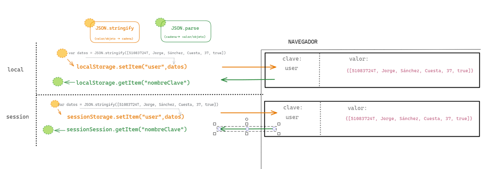

# Web Storage y Métodos de Object

## Web Storage
Web Storage es la nueva caracteristica que traen los navegadores actuales gracias a HTML5 para guardar información en el lado del cliente. 

La información la guardamos al igual en pares clave-valor. Todo lo guardado resulta ser una cadena y la información es persistente sólo el lado del cliente.

Uso y limitaciones:
- 5-10Mb según navegador
- Almacenamiento local (lectura/escritura cliente)
- Sin caducidad
- Funcionamiento clave/valor (diccionario)
- Solo se permite el almacenamiento de cadenas de texto (JSON.stringfy)

**Local Storage vs Session Storage**
- Local Storage no tiene fecha de expiración
- Session Storage solo será válida para la ventana actual en la que estamos navegando y solo son accesibles para el dominio actual. 
- La información de ambas puede ser eliminada si se limpia la información guardada en el navegador.

Recursos
- [MDN | API_de_almacenamiento_web](https://developer.mozilla.org/es/docs/Web/API/API_de_almacenamiento_web)
- [que-es-y-como-utilizar-localstorage-y-sessionstorage](https://ed.team/blog/que-es-y-como-utilizar-localstorage-y-sessionstorage)
- [LocalStorage, sessionStorage](https://javascript.info/localstorage)
- [storing_and_retrieving_an_array_from_local_storage](https://www.kirupa.com/html5/storing_and_retrieving_an_array_from_local_storage.htm)


Veamos ejemplos: 

**Guardar datos:**

```javascript

    localStorage.setItem('name', 'Davinia'); // op1
    localStorage.surname = 'de la Rosa'; // op2

```

**Leer datos:**

```javascript

    let firstName = localStorage.getItem('name');
    let lastName  = localStorage.surname;
    console.log(`Hola, mi nombre es ${firstName} ${lastName}`)
    // o también
    console.log(`Hola, mi nombre es ${localStorage.getItem('name')} ${localStorage.surname}`)

```

**Eliminar datos:**

Se borra por clave

```javascript
    
    localStorage.removeItem('surname');

```

**borrar todo:**

```javascript
    
    localStorage.clear();

```

**Leer todo lo que hay en local Storage:**

```javascript

    for(let i=0; i<localStorage.length; i++) {
        let key = localStorage.key(i);
        alert(`${key}: ${localStorage.getItem(key)}`);
    }

```

**Leer/escribir un objeto de LocalStorage:**

usar JSON.stringify() y JSON.parse() (ya los hemos visto)
- [MDN | JSON.stringify()](https://developer.mozilla.org/es/docs/Web/JavaScript/Referencia/Objetos_globales/JSON/stringify)
- [MDN | JSON.parse()](https://developer.mozilla.org/es/docs/Web/JavaScript/Referencia/Objetos_globales/JSON/parse)

```javascript

    //Escribir
    localStorage.setItem('user', JSON.stringify({
        username: 'Davinia',
        api_key: 'abc123xyz789'
    }));
    //Leer
    var user = JSON.parse(localStorage.getItem('user'));

```

**Leer/escribir un array de LocalStorage:**

```javascript

    var movies = ["Reservoir Dogs", "Pulp Fiction", "Jackie Brown", 
                "Kill Bill", "Death Proof", "Inglourious Basterds"];
    //Escribir
    localStorage.setItem("quentinTarantino", JSON.stringify(movies));

    //Leer
    var retrievedData = localStorage.getItem("quentinTarantino");

```

## Métodos de Object
- [MDN | Objects](https://developer.mozilla.org/es/docs/Web/JavaScript/Referencia/Objetos_globales/Object) 
- [how-to-use-object-methods-in-javascript](https://www.digitalocean.com/community/tutorials/how-to-use-object-methods-in-javascript)

- Object.entries():

```javascript

    // Creamos un objeto
    const operatingSystem = {
        name: 'Ubuntu',
        version: 18.04,
        license: 'Open Source'
    };

    // Obtenemos los conjuntos clave/valor
    const entries = Object.entries(operatingSystem);

    console.log(entries);
    /*
    [
        ["name", "Ubuntu"]
        ["version", 18.04]
        ["license", "Open Source"]
    ]
    */

```

- Object.keys(): 

```javascript

    const employees = {
        boss: 'Michael',
        secretary: 'Pam',
        sales: 'Jim',
        accountant: 'Oscar'
    };

    // Obtenemos las claves en un array
    const keys = Object.keys(employees);

    console.log(keys);//["boss", "secretary", "sales", "accountant"]

```
- Object.values():

```javascript

    const session = {
        id: 1,
        time: `26-July-2018`,
        device: 'mobile',
        browser: 'Chrome'
    };

    // Obtenemos los valores en un array
    const values = Object.values(session);

    console.log(values); // [1, "26-July-2018", "mobile", "Chrome"]

```

- Object.create():

```javascript

    const persona = {
        nombre: 'espacio para el nombre',
        apellidos: 'espacio para los apellidos',
        edad: 'espacio para la edad',
        muestraDatos() {
            const menor = this.edad < 18 ? 'es menor de edad' : 'no es menor de edad';

            alert(`Nombre: ${this.nombre}, Apellidos: ${this.apellidos}.\nTiene ${this.edad} años  y ${menor}`);
        }
    };

    // Creamos un objeto persona (equivalente a new)
    var persona1 = Object.create(persona);
    persona1.nombre = "Rafael";
    persona1["apellidos"] = "Pérez Ramírez";
    persona1["edad"] = 15;
    persona1.muestraDatos();

    // Alternativa con new
    var persona2 = new Object(persona);
    persona2["nombre"] = "Ana";
    persona2.apellidos = "Valcárcel Luis";
    persona2.edad = 43;
    console.log(persona2["muestraDatos"]);
    persona2.muestraDatos();

```

- Object.assign():

```javascript

    //Objeto 1
    const personalInformation = {
        firstName: 'Philip',
        lastName: 'Fry'
    };

    //Objeto 2
    const details = {
        job: 'Delivery Boy',
        employer: 'Planet Express'
    };

    // Objeto resultante de combinar ambos
    var person = Object.assign(personalInformation, details);
    console.log(person);

```


### Ejercicios
1. Formulario de contacto - Local Storage
- Crear un formulario de contacto con los siguientes campos:
  - Nombre
  - Email
  - Mensaje
- Guardar en Local Storage los datos de contacto enviados de cada usuario
- Mostrar los datos de los contactos guardados usando herramientas de DOM
- Usa `JSON.parse()` y `JSON.stringify()` para guardar muchos datos usando la misma clave

2. Avanzado - Local Storage
- Crea botón para borrar todos los contactos guardados en Local Storage
- Crea botón para borrar un contacto en concreto de Local Storage, buscando por email


## Apuntes Coke

```js

//! 1. Añadir al localStorage contenido

localStorage.setItem("Nombre_Clave", "Valor que está 'Stringifycado'");

//! 2. Valor Stringifycado puede ser:

//? 2.1 String, Numeros, booleanos

localStorage.setItem("cadena", "sin variable");
localStorage.setItem("numero", 32.1);
localStorage.setItem("boleano", false);

//? 2.2 Meterlo en variables

var string = JSON.stringify("Hola, lo meto en una variable");
localStorage.setItem("cadenaV", string);

var number = JSON.stringify(32.1 / 4);
localStorage.setItem("numeroV", number);

var boolean = JSON.stringify(true && false);
localStorage.setItem("boleanoV", boolean);

//? 2.3 Meterlo en un Array

let array = ["Jorge", 37, "79", "Madrid", "51234567U", false];
localStorage.setItem("array", array);

//? 2.3 Meterlo en un JSON

localStorage.setItem(
  "jsonSinVariable",
  JSON.stringify({ nombre: "Jorge", dni: "12345678U", admin: true })
);

let jsonCon = {
  nombre: "Coke",
  dni: "12222222U",
  edad: "345",
  admin: false,
};

var jsonString = JSON.stringify(jsonCon);
localStorage.setItem("jsonConVariable", jsonString);

//! 3. Recoger datos del Storage

//? Por el nombre de la key localStorage.getItem("Nombre_Clave") || JSON.parse para "desestringificarlo" y hacerlo Objeto

var info = JSON.parse(localStorage.getItem("jsonConVariable"));
console.log(info);

let user = {
  id: "KGIDM847MJFGU38930",
  name: "raichark",
  games: "435",
  time: "690",
  server: "Golconda",
};

//! Obtención de keys/valores en formato Array

//? // Obtenemos los conjuntos clave/valor
const entries = Object.entries(user);
console.log(`Object.entries(user): `)
console.log(`Obtenemos los conjuntos clave/valor ${entries}`);

//? Obtenemos las claves en un array
const keys = Object.keys(user);
console.log(`Object.keys(user): `)

console.log(`Obtenemos las claves en un array ${keys}`);

//? Obtenemos los valores en un array
const values = Object.values(user);
console.log(`Object.values(user): `)
console.log(`Obtenemos los valores en un array ${values}`);

```

