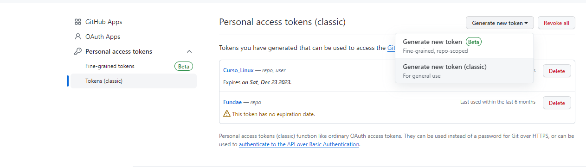

# Git y github en Ubuntu

## Pasos a seguir:

1. Actualiza los repositorios de Ubuntu en tu máquina:

```
sudo apt-get update
```

2. Instala git

```
sudo apt-get install git
```

3. Obten tu token:

Debes acceder a github, al menú: **Settings -> Developer settings -> Personal access tokens -> Tokens (classic)** y generamos un token classic con 60 días de expiración y todos los permisos en repo.





4. Realiza la configuración de los datos de acceso:

```
git config --global user.name USER
git config --global user.email EMAIL
git config --global credential.helper store

```

5. Usa git

En este paso se van a pedir los datos de acceso dentro de la propia terminal tanto para clonar, como para hacer push, debes usar tu user y como pass el token que has generado.

### IMPORTANTE: Por seguridad si salimos del menú de github relacionado con los tokens no nos lo muestra más, guarda el token.

```
git clone URL
git add .
git commit -m "Mensaje"
git push

```
