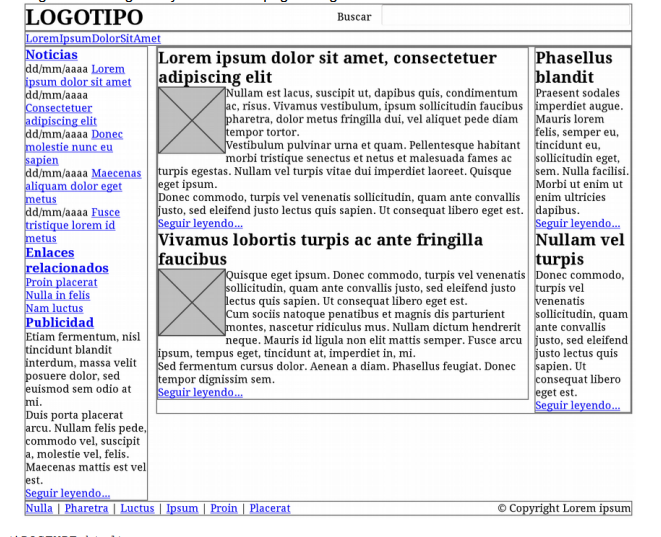

# Ejemplos modelo de cajas

[RESUMEN_UNIDADES_MEDIDA](https://developer.mozilla.org/es/docs/Learn/CSS/Building_blocks/Values_and_units)

## Anchgura y altura 
La propiedades que las definen son width y height respetivamente. 

Veamos un ejemplo usando unidades de medida en píxeles y en porcentajes:

```html

<!DOCTYPE html>
<html lang="es">
<head>
    <meta charset="UTF-8" />
    <title>Ejemplo de Width y Height</title>
    <style type="text/css">
        #pixeles {
            height: 300px;
            width: 200px;
            background-color: blue;
        }

        #porcentaje {
            height: 30%;
            width: 20%;
            background-color: red;
            position: absolute;
            top: 400px;
        }
    </style>
</head>

<body>
    <section>
        <div id="pixeles"></div>
        
        <div id="porcentaje"></div>
    </section>
</body>

</html>

```

## Margen
Podemos usar las propiedades margin-top, margin-right, margin-bottom y margin-left o de manera abreviada la propiedad margin.

En margin: 

- Si solo se indica un valor, todos los márgenes tienen ese valor.

- Si se indican dos valores, el primero se asigna al margen superior e inferior y el segundo se asigna a los márgenes izquierdo y derecho.

- Si se indican tres valores, el primero se asigna al margen superior, el tercero se asigna al margen inferior y el segundo valor se asigna los márgenes izquierdo y derecho.

- Si se indican los cuatro valores, el orden de asignación es: margen superior, margen derecho, margen inferior y margen izquierdo.


Ejemplo 1: Margen izquierdo y derecho

```html

<!DOCTYPE html>
<html lang="es">

<head>
    <meta charset="UTF-8" />
    <title>Ejemplo de margen</title>
    <style type="text/css">
        .destacado {
            margin-left: 2em;
            margin-right: 200px;
        }
    </style>
</head>

<body>
    <section>
        <p>Lorem ipsum dolor sit amet, consectetuer adipiscing elit. Nam et elit.
            Vivamus placerat lorem. Maecenas sapien. Integer ut massa. Cras diam ipsum,
            laoreet non, tincidunt a, viverra sed, tortor.</p>
        <p class="destacado">Vestibulum lectus diam, luctus vel, venenatis ultrices,
            cursus vel, tellus. Etiam placerat erat non sem. Nulla molestie odio non nisl
            tincidunt faucibus.</p>
        <p>Aliquam euismod sapien eu libero. Ut tempor orci at nulla. Nam in eros
            egestas massa vehicula nonummy. Morbi posuere, nibh ultricies consectetuer
            tincidunt, risus turpis laoreet elit, ut tincidunt risus sem et nunc.</p>
    </section>
</body>

```

Ejemplo 2: margin

```html

<!DOCTYPE html>
<html lang="es">
<head>
    <meta charset="UTF-8" />
    <title>Ejemplo magin</title>
    <style type="text/css">
        .destacado {
            margin: 30px 2em 10% 20ex;
        }
    </style>
</head>

<body>
    <section>
        <p>Lorem ipsum dolor ...</p>
        <p class="destacado">Vestibulum lectus diam, ...</p>
        <p>Aliquam euismod sapien eu libero...</p>
    </section>
</body>

</html>

```

**Ejercicio:**

- Modifica el selector para que se comporte de la misma forma, pero sin usar selector de clase.

## Relleno
Podemos usar las propiedades padding-top, padding-right, padding-bottom, padding-left o de forma análoga la propiedad abreviada padding (los valores pueden ser entre uno y cuatro y se definen en el mismo orden que con margin)

```css
body {padding: 2em} /* Todos los rellenos valen 2em */
body {padding: 1em 2em} /* Superior e inferior = 1em, Izquierdo y derecho = 2em
*/
/* Superior = 1em, derecho = 2em, inferior = 3em, izquierdo = 2em */
body {padding: 1em 2em 3em}
/* Superior = 1em, derecho = 2em, inferior = 3em, izquierdo = 4em */
body {padding: 1em 2em 3em 4em} 

```

### Ejercicio: 

- A partir del código HTML y CSS proporcionados, determinar las reglas CSS necesarias para añadir los siguientes márgenes y rellenos. La página original es similar a esta:



**Código HTML:** 
```html

<!DOCTYPE html>
<html lang="es">

<head>
    <meta charset="UTF-8" />
    <title>Ejercicio 3</title>
    <link href="estilos.css" rel="stylesheet" />
</head>

<body>
    <section>
        <!--Inicio Contenedor -->
        <div id="contenedor">
            <div id="cabecera">
                <!--inicio cabecera-->
                <div id="logo">
                    <h1> <span>Mis Noticias</span></h1>
                </div>
                <div id="buscador">
                    <form action="php/Ejercicio03.php" method="post">
                        Buscar: <input type="search" placeholder="realice su busqueda" />
                    </form>
                </div>
                <div class="clear"></div>
            </div>
            <!--fin cabecera-->
            <!--inicio menu principal-->
            <div id="menu">
                <ul>
                    <li><a href="#"> enviar historia</a> |</li>
                    <li><a href="#"> portada</a> |</li>
                    <li><a href="#"> pendientes</a> |</li>
                    <li><a href="#"> populares</a> |</li>
                    <li><a href="#"> más visitadas</a> |</li>
                    <li><a href="#"> destacadas</a> |</li>
                </ul>
                <div class="clear"></div>
            </div>
            <!--fin menu principal-->
            <!--Inicio Lateral Izquierdo -->
            <div id="lateral">
                <!--Inicio Sección Noticias. Enlaces -->
                <div id="noticias">
                    <h3><a href="#">Noticias</a></h3>
                    <p><span class="fecha">dd/mm/aaaa</span></p>
                    <p><a href="#">Lorem ipsum dolor</a></p>
                    <p><span class="fecha">dd/mm/aaaa</span></p>
                    <p><a href="#">Lorem ipsum dolor</a></p>
                    <p><span class="fecha">dd/mm/aaaa</span></p>
                    <p><a href="#">Lorem ipsum dolor</a></p>
                    <p><span class="fecha">dd/mm/aaaa</span></p>
                    <p><a href="#">Lorem ipsum dolor</a></p>
                    <p><span class="fecha">dd/mm/aaaa</span></p>
                    <p><a href="#">Lorem ipsum dolor</a></p>
                    <br />
                    <h3><a href="#">Enlaces relacionados</a></h3>
                    <ul>
                        <li><a href="#"> ipsum</a></li>
                        <li><a href="#"> dolor</a></li>
                        <li><a href="#"> sit</a></li>
                    </ul>
                </div>
                <!--Fin Sección Noticias. Enlaces -->
                <!-- Inicio Sección Publicidad-->
                <div id="publicidad">
                    <h3><a href="#">Publicidad</a></h3>
                    <p>Lorem ipsum dolor sit amet, consectetur adipiscing elit.</p>
                    <p>Vivamus quis arcu massa.</p>
                    <p>Etiam nec risus sit amet lorem tempor hendrerit.</p>
                    <p><a href="#">Seguir leyendo...</a></p>
                </div>
                <!-- Fin Sección Publicidad-->
            </div>
            <!-- Fin Lateral Izquierdo-->
            <!-- Inicio Contenido-->
            <div id="contenido">
                <!-- Inicio Cuerpo Principal-->
                <div id="principal">
                    <!-- Inicio Artículo 1 -->
                    <div class="articulo">
                        <h3>El precio de la libertad de Android </h3>
                        
                        <p>Que Android es un sistema operativo libre (en el sentido de Open
                            Source, se entiende) es algo que estamos hartos de oir. Sin embargo
                            a veces hay ciertas noticias que nos hacen dudar que esta libertad
                            sea tal como en un principio puede parecer.
                            Puesto que la principal diferencia de base de Android con respecto a
                            sus competidores es ser ‘libre’, creemos que este tema merece una buena
                            explicación para aclarar todo lo que hay detrás de esta supuesta
                            libertad.</p>
                        <p>
                            <a href="http://www.elandroidelibre.com/2013/01/el-precio-de-la-libertad-deandroid.html">
                                Seguir leyendo...</a>
                        </p>
                    </div>
                    <!-- Fin Artículo 1 -->
                    <!-- Inicio Artículo 2 -->
                    <div class="articulo">
                        <h3>Richard Stallman:
                            "Tener el control de tu informática es un derecho humano" </h3>
                        
                        <p>"Ecuador es el mejor ejemplo de una política estatal de
                            migración a software libre de las agencias públicas. Con el software libre los
                            usuarios tienen el control del programa, si éste no es libre, es el programa
                            quien controla a los usuarios. Cuando el usuario es el Estado, estamos hablando
                            del control de su soberanía informática. Cualquier país debe migrar al software
                            libre para echar al software privativo, ahora mismo Ecuador tiene la mejor
                            política en ese sentido." </p>
                        <p>
                            <a
                                href="http://www.lamarea.com/2013/01/30/tener-el-control-de-tu-informatica-esun-derecho-humano/">Seguir
                                leyendo...</a>
                        </p>
                    </div>
                    <!-- Fin Artículo 2 -->
                </div>
                <!-- Fin Cuerpo Principal-->
                <!-- Inicio Cuerpo Secundario-->
                <div id="secundario">
                    <h3>Las mejores catástrofes culinarias de Pinterest</h3>
                    <p>La vida no es como aparece en Pinterest. Y la cocina, menos.
                        Y la repostería, menos todavía. </p>
                    <p><a href="#">Seguir leyendo...</a></p>
                    <br />
                    <h3>La madre que usó una tarjeta perdida para comprar pañales,
                        a prisión en 15 días</h3>
                    <p>Emilia Soria, la joven que hace seis años utilizó una tarjeta
                        que se encontró en la calle para comprar pañales y comida para sus hijas, irá a
                        la cárcel en un plazo máximo de quince días.
                    </p>
                    <p><a href="#">Seguir leyendo...</a></p>

                </div>
                <!-- Fin Cuerpo Secundario-->
            </div>
            <!-- Fin Contenido -->
            <div class="clear"></div>
            <!--Inicio Pie -->
            <div id="pie">
                <span class="enlaces">
                    <a href="#"> todas</a> |
                    <a href="#"> actualidad</a> |
                    <a href="#"> cultura</a> |
                    <a href="#"> ocio</a> |
                    <a href="#"> tecnología</a>
                </span>
                <span class="copyright">
                    &copy; 2013 Iván Rodríguez
                </span>
                <div class="clear"></div>
            </div>
            <!--Fin Pie -->
        </div>
        <!--Fin Contenedor -->
    </section>
</body>

</html>

```

Código CSS: 

```css

/* ------- CONTENEDOR ---------*/
#contenedor {
    width: 90%;
    max-width: 900px;
    margin: 0 auto;
    /* La URL de la textura es: (buscamos en Google fondos web blue) 
    www.miswallpapers.net/2008-
    2009Walls/varios/wallpaper_97_Blue_lines_1600x1200.jpg */
    background-image: url('../img/textura.jpg');
}

/* ################## CAJAS PRINCIPALES #################### */
#cabecera, #menu, #lateral, #contenido, #principal, #secundario, #pie {
    border: 2px solid #777;
}

#noticias,#publicidad,#principal,#secundario {}

#cabecera,
#menu {
    clear: both;
}

/* --------- CABECERA ---------*/
#cabecera {}

#logo {
    float: left;
}

#buscador {
    float: right;
}

/* -------- MENU SUPERIOR -----------*/
#menu {}

#menu ul,
#menu li {
    display: inline;
    float: left;
}

/* -------- CAJA LATERAL ----------- */
#lateral {
    float: left;
    width: 20%;
}

#publicidad {}

/* ############ CAJA CONTENIDO ############# */
#contenido {
    float: right;
    width: 78%;
}

/* --------- CAJA PRINCIPAL --------*/
#principal {
    float: left;
    width: 68%;
}

img {
    border: none;
}

.articulo img {
    width: 100px;
    float: left;
}

.articulo {
    font-size: 15px;
}

/* -------------- COLUMNA DERECHA -----------*/
#secundario {
    float: right;
    /*se ha cambiado de left a right*/
    width: 25%;
}

/* ############ FIN CAJA CONTENIDO ############# */
/* ------------ CAJA PIE ------------*/
#pie {
    clear: both;
}

#pie .enlaces {
    float: left;
}

#pie .copyright {
    float: right;
}

/* ######## REGLAS GENÉRICAS ####### */
ul,
ul li {
    margin: 0;
    padding: 0;
    list-style: none;
}

h1,h3,p,form {
    margin: 0;
    padding: 0;
}

.clear {
    clear: both;
}

```

**Se pide:**

1. El elemento #cabecera debe tener un relleno de 1em en todos los lados. 
2. El elemento #menu debe tener un relleno de 0.5em en todos los lados y un margen inferior
y superior de 0.5em. 
3. El resto de elementos (#noticias, #publicidad, #principal, #secundario) deben tener 0.1em
de relleno en todos sus lados, salvo el elemento #pie, que sólo debe tener relleno en la
zona superior e inferior. 
4. Los elementos .articulo deben mostrar una separación entre ellos de 1em. 
5. Las imágenes de los artículos muestran un margen de 0.5em en todos sus lados. 
6. El elemento #publicidad está separado 1em de su elemento superior. 
7. El elemento #pie debe tener un margen superior de 1em.

## Bordes

### Anchura de los bordes
Las propiedades que lo definen son border-top-width, border-right-width, border-bottom-width, border-left-widt; y para poder visualizarlos hay que definirlos primero con la propiedad border.

La anchura de los bordes se indica mediante una medida (en cualquier unidad de medida absoluta o relativa) o mediante las palabras clave thin (borde delgado), medium (borde normal) y thick (borde ancho).

Se suelen usar más las unidades de medida que las palabras clave.

Ejemplo: 

```html

<!DOCTYPE html>
<html lang="es">
<head>
    <meta charset="UTF-8" />
    <title>Anchura bordes con CSS</title>
    <style type="text/css">
        div {
            border: 2px solid;
            /* Aplicamos 1º un borde */
            border-top-width: 10px;
            /* Sin bordes no podremos ver los anchos */
            border-right-width: 1em;
            border-bottom-width: thick;
            border-left-width: thin;
        }
    </style>
</head>
<body>
    <section>
        <div>
            <p>Lorem ipsum dolor </p>
            <p>Vestibulum lectus diam, </p>
            <p>Aliquam euismod sapien eu libero</p>
        </div>
    </section>
</body>

</html>

```

Disponemos de una propiedad abreviada, como en los casos anteriores: 

```css

p { border-width: thin } /* thin thin thin thin - Todos*/
p { border-width: thin thick } /* thin thick thin thick Superior e inferior, izquierdo y derecho */
p { border-width: thin thick medium } /* thin thick medium thick Superior, izquiero y derecho, inferior */
p { border-width: thin thick medium thin } /* thin thick medium thin Superior, derecho, inferior, izquierdo */

```

### Color de los bordes

Las propiedades que lo definen son border-top-color, border-right-color, border-bottom-color, border-left-color.

Veamos un ejemplo basado en el anterior.

```html
<!DOCTYPE html>
<html lang="es">

<head>
    <meta charset="UTF-8" />
    <title>Color bordes con CSS</title>
    <style type="text/css">
        div {
            border: 2px solid;
            border-width: 10px 1em thick thin;
            /* Hemos usado una propiedad abreviada */
            border-top-color: #CC0000;
            border-right-color: blue;
            border-bottom-color: #00FF00;
            border-left-color: #CCC;
        }
    </style>
</head>

<body>
    <section>
        <div>
            <p>Lorem ipsum dolor ...</p>
            <p>Vestibulum lectus diam, ...</p>
            <p>Aliquam euismod sapien eu libero...</p>
        </div>
    </section>
</body>

</html>

```

Disponemos de la propiedad abreviada correspondiente: border-color 

### Estilos de los bordes
Las propiedades son border-top-style, border-right-style, border-bottom-style y border-left-style.
En este caso debemos usar las palabras reservadas para definir los estilos de los bordes.

[BORDES](https://developer.mozilla.org/es/docs/Web/CSS/border-style)

Ejemplo: 

```html
<!DOCTYPE html>
<html lang="es">

<head>
    <meta charset="UTF-8" />
    <title>Anchura con CSS</title>
    <style type="text/css">
        p {
            border-width: 4px;
        }

        .a {
            border-style: dashed
        }

        .b {
            border-style: dotted
        }

        .c {
            border-style: double
        }

        .d {
            border-style: groove
        }

        .e {
            border-style: inset
        }

        .f {
            border-style: outset
        }

        .g {
            border-style: ridge
        }

        .h {
            border-style: solid
        }

        .especial {
            border-color: red;
            border-top-style: dashed;
            border-right-style: ridge;
            border-bottom-style: groove;
            border-left-style: solid;
        }
    </style>
</head>

<body>
    <section>
        <div>
            <p class="a">Lorem ipsum dolor ...</p>
            <p class="b">Lorem ipsum dolor ...</p>
            <p class="c">Lorem ipsum dolor ...</p>
            <p class="d">Lorem ipsum dolor ...</p>
            <p class="e">Lorem ipsum dolor ...</p>
            <p class="f">Lorem ipsum dolor ...</p>
            <p class="g">Lorem ipsum dolor ...</p>
            <p class="h">Lorem ipsum dolor ...</p>
            <p class="especial"> Estilos Múltiples</p>
        </div>

    </section>
</body>

</html>

```

Su propiedad abreviada es border-top-style.

### Propiedad abreviada global
Podemos usar la propiedad border, pero hay que conocer ciertas reglas:

**Ejemplo 1: Las siguiente dos formas son equivalentes**

```css
div { 
    border-top: 1px solid red;
    border-right: 1px solid red;
    border-bottom: 1px solid red;
    border-left: 1px solid red;
}

div { border: 1px solid red; }

```
Como el valor por defecto de la propiedad border-style es none, si una propiedad shorthand no establece explícitamente el estilo de un borde, el elemento no muestra ese borde:

**Ejemplo 2_:**
```css

/* Sólo se establece el color, por lo que el estilo es  "none" y el borde no se muestra */
div { border: red; }
/* Se establece el grosor y el color del borde, pero no  su estilo, por lo que es "none" y el borde no se muestra */
div { border-bottom: 5px blue; }

```
Cuando los cuatro bordes no son idénticos pero sí muy parecidos, se puede utilizar la propiedad border para establecer de forma directa los atributos comunes de todos los bordes y posteriormente especificar para cada uno de los cuatro bordes sus propiedades particulares:

**Ejemplo 3:**
```css

h1 { 
    border: solid #000;
    border-top-width: 6px;
    border-left-width: 8px; 
    }

```

## Fondo
Para colocar el fondo del contenido de la caja, podemos usar la propiedad abreviada background o las específicas, que puedes ver en el siguiente enlace: 

[BACKGROUND](https://www.w3schools.com/css/css_background.asp)


