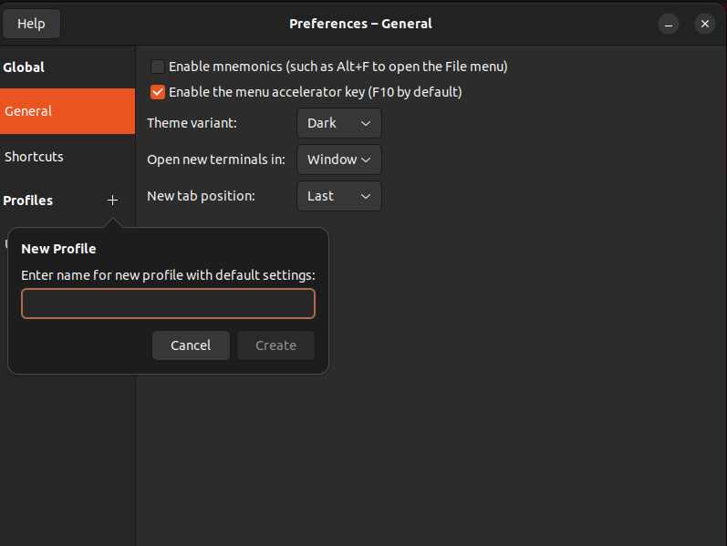
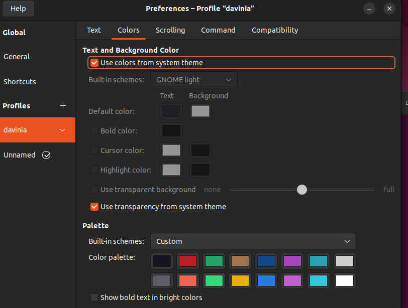

# Personalizar la terminal en gnome

Debemos crear un perfil en el menú Preferencias (Preferences), pulsando en el + de Profiles (Perfiles)

Una vez creado, podremos pinchar en él y personalizar los colores y la transparencia.

Te recomiendo que "juegues" un poco con esto y lo dejes a tu gusto (por supuesto, hay más menús y opciones que puedes configurar, por ejemplo las fuentes)
